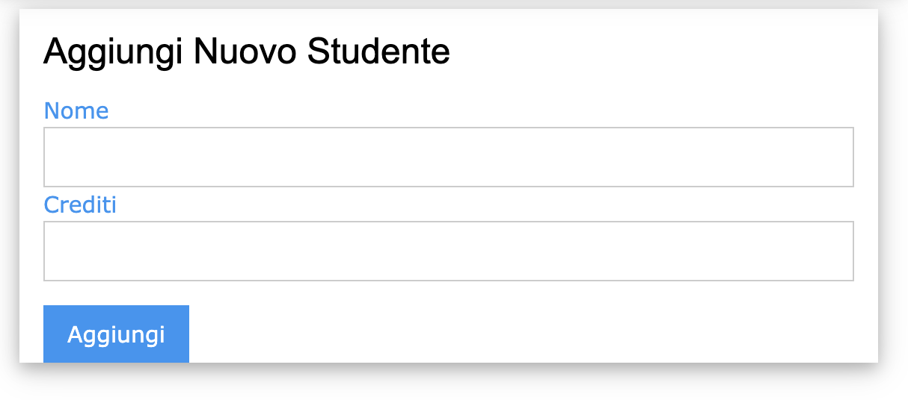
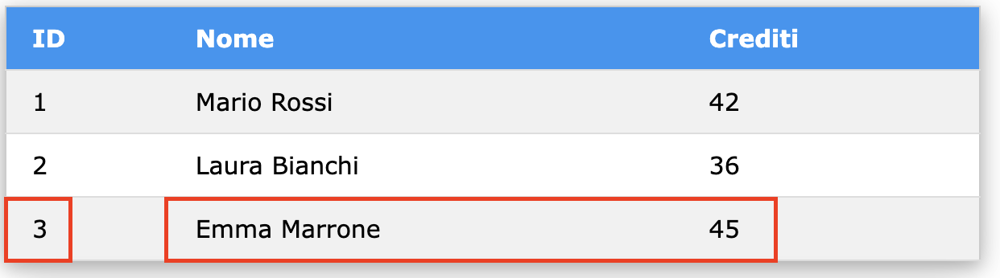

[⬅️ [TORNA ALL'INDICE] ](../README.md)

# Esercitazione con JSON

## Obiettivo
Creare un'applicazione web che gestisce una lista di studenti. Per ogni studente memorizziamo:
- ID univoco (generato automaticamente)
- Nome completo
- Numero di crediti acquisiti

L'applicazione deve:
1. Mantenere i dati in un file JSON sul server
2. Mostrare una tabella con tutti gli studenti
3. Permettere l'inserimento di nuovi studenti
4. Visualizzare automaticamente la lista aggiornata dopo ogni inserimento

## Passo 1: Creazione File JSON Iniziale
Creiamo la directory data in backend. Da terminale:
```bash
mkdir backend/data/
```
Creiamo il file json nella directory data `backend/data/studenti.json` con alcuni dati di esempio:
```json
{
    "studenti": [
        {
            "id": 1,
            "nome": "Mario Rossi",
            "crediti": 42
        },
        {
            "id": 2,
            "nome": "Laura Bianchi",
            "crediti": 36
        }
    ]
}
```

## Passo 2: Implementiamo il Server
Costruiamo passo passo il programma `backend/app.js`.

**Importiamo i moduli**
```javascript
const fs = require('fs');
const path = require('path');
const express = require('express');
const app = express();
```
Oltre ai moduli che già conosciamo (express), abbiamo aggiunto:
- **fs**: modulo per operazioni sul filesystem (lettura/scrittura file, creazione cartelle)
- **path**: modulo per gestire e manipolare percorsi di file e directory in modo cross-platform (Windows, Linux, Mac, ...).

**Scriviamo la configurazione Iniziale**
```javascript
// Configurazione
app.set('view engine', 'ejs');
app.use(express.urlencoded({ extended: true }));

// Percorso del file JSON
const dataPath = path.join('backend', 'data', 'studenti.json');
```
- Imposta EJS come template engine
- Definisce il path per accedere ai dati JSON salvati sullo Storage locale.

**Scriviamo le funzioni per leggere e salvare i file JSON**
```javascript
// Funzione per leggere il file JSON
function leggiJsonStudenti() {
    try {
        const data = fs.readFileSync(dataPath, 'utf8');
        return JSON.parse(data);
    } catch (error) {
        console.error('Errore lettura file:', error);
        return { studenti: [] };
    }
}

// Funzione per salvare nel file JSON
function salvaJsonStudenti(data) {
    try {
        //I parametri null, 4 permettono di scrivere il file json con
        // l'indentazione, in modo che sia facilmente leggibile.
        fs.writeFileSync(dataPath, JSON.stringify(data, null, 4));
        return true;
    } catch (error) {
        console.error('Errore scrittura file:', error);
        return false;
    }
}
```
**leggiJsonStudenti**
- Legge il file in modo sincrono
- Gestisce eventuali errori
- Ritorna un oggetto vuoto se il file non esiste

**salvaJsonStudenti**
- Scrive il file in modo sincrono. I parametri "null, 4" permettono di scrivere il file json usando l'indentazione, in modo che sia facilmente leggibile.
- Gestisce eventuali errori
- Scrive un messaggio sul log del server in caso di errore.


**Scriviamo la Route GET '/'**
```javascript
// Route principale
app.get('/', (req, res) => {
    const data = leggiJsonStudenti();
    res.render('index', { studenti: data.studenti });
});
```
Quando viene richiesta la pagina principale:
- Legge i dati dal file JSON e li conserva nella struttura in memoria chiamata **data**
- Passa l'array studenti **data.studenti** al template EJS per visualizzare la lista completa degli studenti.

**Scriviamo la Route POST '/aggiungi-studente'**
```javascript
// Route per aggiungere studente
app.post('/aggiungi-studente', (req, res) => {
    // Leggi dati esistenti
    const data = leggiJsonStudenti();
    
    // Calcola nuovo ID, aggiungendo 1 al valore più grande
    let nuovoId = 1;
    let iMax = 0;
    for (let i = 0; i < data.studenti.length; i++) {
        if (data.studenti[i].id > data.studenti[iMax].id) {
            iMax = i;
            nuovoId = data.studenti[iMax].id + 1;
        }
    }
    
    // Crea nuovo studente
    const nuovoStudente = {
        id: nuovoId,
        nome: req.body.nome,
        crediti: parseInt(req.body.crediti)
    };
    
    // Aggiungi il nuovo studente alla struttura e lo salva in JSON
    data.studenti.push(nuovoStudente);
    salvaJsonStudenti(data);
    
    // Redirect alla home
    res.redirect('/');
});
```

Quando viene premuto il pulsante del form e quindi viene richiesto **aggiungi-studente**:
- Si calcola nuovo ID da usare per il nuovo studente. Il nuovo ID è un numero progressivo calcolato sul massimo ID esistente.
- Crea in memoria nuovo oggetto studente
- Aggiunge l'oggetto alla struttura che contiene tutti gli studenti
- Salva il file JSON su server. Il File JSON conterrà anche il nuovo studente appea inserito
- Si viene reindirizzati alla pagina principale, in modo da visualizzare la lista aggiornata.

** Aggiungiamo la Configurazione per l'avvio del server**
```javascript
const PORT = 3000;
app.listen(PORT, () => {
    console.log(`Server is running on http://localhost:${PORT}`);
});
```

## Passo 3: Template EJS
Creiamo il file `views/index.ejs`:
```html
<!DOCTYPE html>
<html>
<head>
    <title>Gestione Studenti</title>
    <link rel="stylesheet" href="https://www.w3schools.com/w3css/4/w3.css">
    <meta charset="UTF-8">
</head>
<body>
    <div class="w3-container">
        <h2 class="w3-text-blue">Lista Studenti</h2>
        
        <!-- Tabella Studenti -->
        <table class="w3-table-all w3-card-4 w3-margin-bottom">
            <tr class="w3-blue">
                <th>ID</th>
                <th>Nome</th>
                <th>Crediti</th>
            </tr>
            <% studenti.forEach(function(s) { %>
                <tr>
                    <td><%= s.id %></td>
                    <td><%= s.nome %></td>
                    <td><%= s.crediti %></td>
                </tr>
            <% }); %>
        </table>

        <!-- Form Nuovo Studente -->
        <form action="/aggiungi-studente" method="POST" 
              class="w3-container w3-card-4 w3-margin">
            <h3>Aggiungi Nuovo Studente</h3>
            
            <label class="w3-text-blue">Nome</label>
            <input class="w3-input w3-border" type="text" 
                   name="nome" required>
            
            <label class="w3-text-blue">Crediti</label>
            <input class="w3-input w3-border" type="number" 
                   name="crediti" min="0" max="100" required>
            
            <button class="w3-btn w3-blue w3-margin-top" 
                    type="submit">Aggiungi</button>
        </form>
    </div>
</body>
</html>
```

### Spiegazione del Template

**Struttura HTML**
- Usa W3.CSS per lo stile
- In testa crea una tabella con gli studenti salvati sul server
- Dopo la tabella crea un form per l'inserimento di un nuovo studente

**Tabella Studenti**
```html
<% studenti.forEach(function(s) { %>
    <tr>
        <td><%= s.id %></td>
        <td><%= s.nome %></td>
        <td><%= s.crediti %></td>
    </tr>
<% }); %>
```
- Il template riceve l'array data.studenti da app.js
- Itera sull'array degli studenti, e per ogni elemento s:
- Crea una riga della tabella riportando id, nome, crediti

**Form Inserimento**
```html
<form action="/aggiungi-studente" method="POST" 
        class="w3-container w3-card-4 w3-margin">
    <h3>Aggiungi Nuovo Studente</h3>
    
    <label class="w3-text-blue">Nome</label>
    <input class="w3-input w3-border" type="text" 
            name="nome" required>
    
    <label class="w3-text-blue">Crediti</label>
    <input class="w3-input w3-border" type="number" 
            name="crediti" min="0" max="100" required>
    
    <button class="w3-btn w3-blue w3-margin-top" 
            type="submit">Aggiungi</button>
</form>        
```
- La validazione dei valori viene fatta sfruttando HTML5. Prima di inviare il form al server, si controlla che i crediti siano compresi fra 0 e 100.
- Alla pressione del pulsante [Aggiungi], viene effettuata la chiamata POST ad aggiungi-studente per l'inserimento del nuovo studente.


## Test dell'Applicazione
1. Da Terminale, interrompere con Ctrl-C eventuali esecuzioni precedenti ed avviare la versione aggiornata:
```bash
node backend/app.js
```

2. Aprire la finestra PORTS, copiare e incollare l'indirizzo web nel Simple Browser o su un Web Browser.


3. La lista degli studenti viene visualizzata in una tabella


4. Viene visualizzato il form per l'inserimento di un nuovo studente



5. Inserire un nuovo studente, premere il pulsante [Aggiungi] e controllare che il nuovo studente sia presente nella lista. In particolare controllare che l'id calcolato sul server sia un numero progressivo rispetto agli studenti già presenti.





6. Ispezionare il file JSON sullo storage locale del server nel file *backend/data/studenti.json*. Controllare che siano stati memorizzati tutti gli studenti:

```json
{
    "studenti": [
        {
            "id": 1,
            "nome": "Mario Rossi",
            "crediti": 42
        },
        {
            "id": 2,
            "nome": "Laura Bianchi",
            "crediti": 36
        },
        {
            "id": 3,
            "nome": "Emma Marrone",
            "crediti": 45
        }
    ]
}
```


[⬅️ [TORNA ALL'INDICE] ](../README.md)